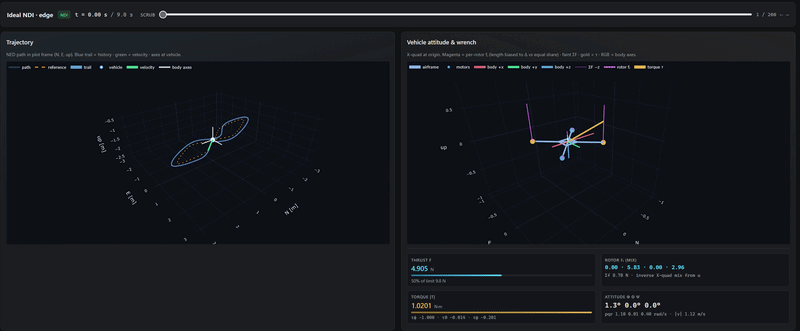
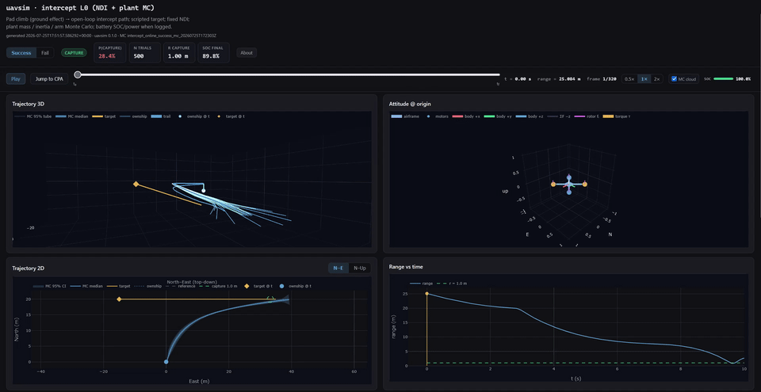

# quadrotor-sim (`uavsim`)

**Software-in-the-loop (SIL) quadrotor GNC** — configure a vehicle and mission, close the loop with **LQR**, cascade **PID**, or cascade **NDI**, run Monte Carlo, estimate state with optional KF/MEKF, and compare runs. Portfolio-grade analysis report (GitHub Pages showcase). Not flight-critical software.

<p align="center">
  <a href="https://trey-copeland.github.io/uavsim/">
    
  </a>
  <br />
  <sub><a href="https://trey-copeland.github.io/uavsim/"><strong>Live portfolio showcase</strong></a> — controller × sensor matrix, Flight 3D, MC, envelope</sub>
</p>

<p align="center">
  <a href="https://trey-copeland.github.io/uavsim/intercept/">
    
  </a>
  <br />
  <sub><a href="https://trey-copeland.github.io/uavsim/intercept/"><strong>Live intercept dashboard</strong></a> — online G-6 pursue, MEKF, battery, plant MC · <a href="docs/tutorials/01_online_intercept.md">tutorial</a></sub>
</p>

| | |
|--|--|
| **Live portfolio showcase** | **[trey-copeland.github.io/uavsim](https://trey-copeland.github.io/uavsim/)** |
| **Live intercept dashboard** | **[…/uavsim/intercept/](https://trey-copeland.github.io/uavsim/intercept/)** |
| **Install** | Python 3.11+ · [uv](https://docs.astral.sh/uv/) · `uv sync --extra dev` |
| **Heritage** | Redesign of **[quad_uav](https://github.com/trey-copeland/quad_uav)** (ME590 MATLAB) — not a line-for-line port |
| **License** | [MIT](LICENSE) |

> **Simulation only.** Not flight-critical or certified software.  
> **Scope & honesty:** [docs/LIMITATIONS.md](docs/LIMITATIONS.md) — what LQG means, sensor proxies, and what results do *not* claim.

---

## Features

### Plant & vehicles
- Nonlinear **6-DoF** rigid-body dynamics (NED, body wrench)
- **Euler** (default) or **unit-quaternion** plant (`sim.attitude: quat`) via pluggable [`DynamicsModel`](docs/developer/dynamics.md)
- Optional **mixer + first-order motors** (`sim.plant: motors`) — control allocation uses arm length / \(c_T,c_Q\)
- Optional **aero**: body drag, prop H-force, ground effect (`vehicle.aero`, off by default)
- YAML vehicles: mass, inertia, arm length, limits, propulsion, aero — [vehicles guide](docs/developer/vehicles.md)

### Guidance
- **Hold** and **waypoint** missions (interp / min-snap / auto)
- **Online intercept** (`intercept_pursue`, G-6 replan) toward a scripted target — [tutorial](docs/tutorials/01_online_intercept.md)
- Feasibility checks (yaw rates, trajectory stress cases)
- Config-driven missions under `configs/missions/` — [guidance guide](docs/developer/guidance.md)

### Control
- **LQR hover** design on linearization (heritage Q/R style)
- **LQG path**: same LQR on KF estimates from partial sensors
- **PID cascade** and cascade **NDI** (nonlinear dynamic inversion; vacuum rigid-body inverse)
- **SO(3) attitude error** in control/metrics (not naive Euler subtract)
- **Tracking envelope**: time-scale sweep across controller × sensor stacks (incl. ideal NDI)
- Runs write **SIL** `nominal/controller_artifact.yaml` (gains / trim for provenance and round-trip)
- **TODO:** HIL / target-ready **controller export** (firmware handoff, fixed-rate packing) — not shipped as a handoff product yet — [control guide](docs/developer/control.md) · [EXTENSIBILITY_TODO](docs/developer/EXTENSIBILITY_TODO.md)

### Estimation (optional)
- Observer-in-the-loop: plant → noisy measurements → filter → controller
- **`partial_raw`**: naive pack of measured channels (zeros elsewhere) — teaching baseline
- **`linear_kf`** (hover \(A,B\)) and **`mekf`** (error-state / multiplicative attitude)
- Channels: `pos` / `att` / `vel` / `omega`, plus GPS-denied **`body_vel` (optical-flow proxy)**, **`alt`**, `vel_xy`
- Sensor stories: GPS+IMU, AHRS, **flow+altitude**, IMU-only — same matrix for **LQR / PID / NDI**
- Estimates logged as `x_hat` — [estimation guide](docs/developer/estimation.md)

### Studies, robustness & systems
- Config-driven **`simulate` / `study`** pipelines with seed-stable Monte Carlo
- Mass / inertia / arm **parameter scatter**; sharded MC + Docker — [containers](docs/containers.md)
- Versioned **run directories** (metrics, timeseries, manifests, reports)

### Visualization & compare
- Interactive **3D flight** scrubber, strip charts, MC hist/CDF/sensitivity grids — [viz](docs/viz.md)
- **`compare`** two SIL run directories (metrics deltas + path overlay)
- **React portfolio showcase** (GitHub Pages) — multi-mission design-review surface — [showcase](docs/showcase/README.md)

### Extensibility (direction of travel)
- Multi-airframe / flex / motors backlog — [airframes](docs/developer/airframes.md) · [EXTENSIBILITY_TODO](docs/developer/EXTENSIBILITY_TODO.md)
- Architecture & HIL seams — [ARCHITECTURE](docs/ARCHITECTURE.md)

---

## CLI at a glance

| Command | Purpose |
|---------|---------|
| `uavsim simulate` | Nominal closed-loop SIL study |
| `uavsim study` | Nominal + optional Monte Carlo |
| `uavsim report` | Markdown report + figures (optional interactive 3D) |
| `uavsim compare` | Diff two SIL run directories |
| `uavsim gallery` | Build the React results showcase |
| `uavsim mc-shard` / `mc-merge` | Sharded MC workers |
| `uavsim export-controller` | **SIL only:** re-export `controller_artifact.yaml` from a run (not HIL handoff) |
| `uavsim hil` | HIL session stub (**TODO** / post-core) |

```bash
uv run uavsim --help
```

---

## Documentation

### Start here

| Doc | Role |
|-----|------|
| **[Developer hub](docs/developer/README.md)** | How to extend vehicles, control, guidance, dynamics, estimation |
| **[SPEC.md](SPEC.md)** | Product scope, requirements, acceptance |
| **[ARCHITECTURE.md](docs/ARCHITECTURE.md)** | Packages, data flow, SIL/HIL seams |
| **[ROADMAP.md](ROADMAP.md)** | Phases, milestones, now / next / later |
| **[LIMITATIONS.md](docs/LIMITATIONS.md)** | Honest framing (LQG naming, sensors, NDI vacuum inverse) |

### How-to guides

| Doc | Role |
|-----|------|
| [Vehicles](docs/developer/vehicles.md) | YAML vehicle params and limits |
| [Dynamics](docs/developer/dynamics.md) | Euler/quat plant, SO(3) error, `DynamicsModel` |
| [Control](docs/developer/control.md) | LQR, PID, **NDI**, SIL artifacts; HIL export TODO |
| [Guidance](docs/developer/guidance.md) | Missions, waypoints, backends |
| [Estimation](docs/developer/estimation.md) | KF/MEKF, channels, `sim.observer` |
| [Airframes](docs/developer/airframes.md) | Multi-airframe vision + HIL rig notes |
| [Extensibility backlog](docs/developer/EXTENSIBILITY_TODO.md) | What works today vs TODO |
| [Visualization](docs/viz.md) | Report figure pack (§11A) |
| [Showcase / Pages](docs/showcase/README.md) | React demo hosting + study matrix |
| [Tutorials](docs/tutorials/README.md) | First run · online intercept · battery |
| [Intercept demo](docs/demos/intercept/README.md) | SPA + export pack for `/intercept/` |
| [Containers](docs/containers.md) | Docker + sharded MC |

### Process

| Doc | Role |
|-----|------|
| [GROK.md](GROK.md) | Working agreements, tests, heritage rules |
| [AGENTS.md](AGENTS.md) | Agent entry → `GROK.md` |

---

## Live showcase & demos

**→ [Open the live showcase](https://trey-copeland.github.io/uavsim/)** · **[Open the intercept dashboard](https://trey-copeland.github.io/uavsim/intercept/)**

| | Portfolio showcase | Intercept dashboard |
|--|--------------------|---------------------|
| **Preview** | [`docs/uavsim.gif`](docs/uavsim.gif) (linked above) | [`docs/demo-intercept.gif`](docs/demo-intercept.gif) (linked above) |
| **Live** | [trey-copeland.github.io/uavsim](https://trey-copeland.github.io/uavsim/) | […/uavsim/intercept/](https://trey-copeland.github.io/uavsim/intercept/) |
| **Local** | `python -m http.server 8765 --directory docs/showcase` | `python -m http.server 8765 --directory docs/demos/intercept` |
| **Source** | [`docs/showcase/`](docs/showcase/) | [`docs/demos/intercept/`](docs/demos/intercept/) |
| **How-to** | [showcase README](docs/showcase/README.md) | [tutorials](docs/tutorials/README.md) · [demo README](docs/demos/intercept/README.md) |
| **Pages CI** | [`.github/workflows/pages-site.yml`](.github/workflows/pages-site.yml) publishes **both** | same |

**Showcase:** controller × sensor matrix, multi-mission stress, plant fidelity, **LQR / PID / NDI**, envelope, MC — Flight 3D · System · metrics · envelope · compare.  
**Intercept:** pad climb + GE, **online** `intercept_pursue`, MEKF, battery SOC, plant MC cloud — [T-GUIDE-ONLINE](docs/tutorials/01_online_intercept.md).

---

## Quickstart

Requires [uv](https://docs.astral.sh/uv/) and Python 3.11+.  
**Walkthrough:** [docs/tutorials/00_first_run.md](docs/tutorials/00_first_run.md) (install → simulate → report).

```bash
uv sync --extra dev
uv run pre-commit install   # once per clone: ruff lint+format on commit
uv run uavsim --help
uv run pytest
uv run ruff check src tests
```

### Representative studies

```bash
# Ideal full-state laws
uv run uavsim simulate configs/studies/figure_eight.yaml          # LQR
uv run uavsim simulate configs/studies/figure_eight_pid.yaml      # PID
uv run uavsim simulate configs/studies/figure_eight_ndi.yaml      # NDI

# Estimation (LQG = KF + LQR)
uv run uavsim simulate configs/studies/figure_eight_gps_imu_lqg.yaml
uv run uavsim simulate configs/studies/figure_eight_gps_imu_naive.yaml
uv run uavsim simulate configs/studies/figure_eight_flow_alt_lqg.yaml

# Hi-fi plant / aggressive three-law compare
uv run uavsim simulate configs/studies/figure_eight_motors.yaml
uv run uavsim simulate configs/studies/law_compare_hifi_ndi.yaml

# Monte Carlo (small N for a quick loop)
uv run uavsim study configs/studies/hover_mc_smoke.yaml
uv run uavsim study configs/studies/figure_eight_mc.yaml --n-trials 20
uv run uavsim report runs/<study_id>_<timestamp>/ --interactive

# Compare two SIL runs
uv run uavsim compare runs/<run_a> runs/<run_b> --figures

# Portfolio showcase (MC default N≈200 — slow; smoke with --n-mc-trials 8)
uv run uavsim gallery --base-case
python -m http.server 8765 --directory docs/showcase
```

More study YAMLs live under [`configs/studies/`](configs/studies/). Artifacts land in `runs/<study_id>_<timestamp>/` (gitignored): metrics, timeseries, optional MC tables, reports. Viz extras: `uv sync --extra viz` (matplotlib + plotly). Containers: [docs/containers.md](docs/containers.md).

---

## Heritage

Prior implementation and domain reference: **[quad_uav](https://github.com/trey-copeland/quad_uav)** (ME590 quadrotor GNC, MATLAB). This project is a **clean redesign** (architecture, Python packaging, studies pipeline, viz, estimation, multi-law portfolio). Runtime does **not** depend on MATLAB or on that repository.

---

## License

[MIT](LICENSE)
